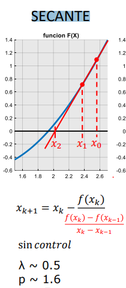

# VisBasic_NumMethods
This was made for the final project of the Numerical Analyisis course. The Macro used on this spredsheet makes use of 2 algorithms (Secant and Gauss-Seidel methods) to aproximate the solution of a physics problem : Finding the a value for a resistance such that the current flowing through a certain branch of an electric circuit is aproximate enough to the asked value. For that it needs to iterate the algorithm's formula as shown below :

 

  
  

 
 

  
  

  
  

  
  

To see the code you just need to click on Tools > Macro > Edit Macro. Then in the left column make a click on the name of this file > VBA Project > Modules.
